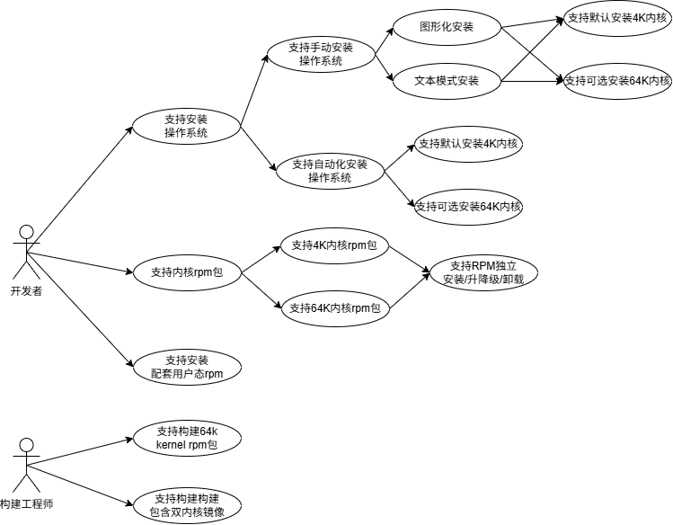
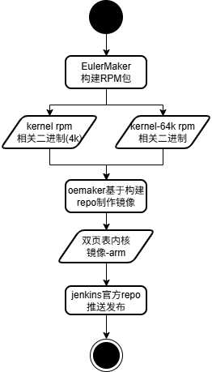
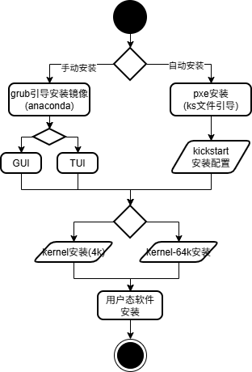

# 1、需求描述
_描述该特性要做什么_ _可以包含需求背景，目标，竞争力等_

对于ARM服务器，64K页性能优于4K页性能场景占比60%，在大数据、数据库、分布式存储等场景64K页性能平均存在5%的性能优势；且随硬件规格内存上升，如AI、大数据等内存敏感型应用，由64K页的TLB Miss减少能带来的性能提升。而当前openEuler自22.03 LTS版本后，仅支持默认4K内核与镜像安装，且64k内核仅通过EPOL发布源进行发布。随64k的社区性能诉求强烈，该需求目标旨在提升社区对64K内核的易用性，让开发者能够更方便的安装与获取。

## 1.1、受益人
_围绕特性价值，该特性实现后给哪些角色带来益处，哪些角色会使用，这里可以是逻辑上的受益者，比如：系统管理员，前端界面等_
|角色|角色描述|
|:--|:-------|
| 开发者 | 所有对应用系统性能有诉求的开发者均收益 |

## 1.3、依赖组件
|组件|组件描述|可获得性|
|:--|:-------|:------|
| kernel | 开源内核 | 开源软件,不涉及 |
| anaconda | 开源镜像安装组件 | 开源软件，不涉及 |
| oemaker | openEuler社区自演进镜像制作工具 | openEuler自孵化软件，不涉及 |
| openEuler jenkins基础设施 | openEuler社区流水线 | openEuler自建基础设施，不涉及 |
| EulerMaker构建工程 | openEuler社区构建系统 | openEuler自建基础设施，不涉及 |

## 1.3、License

1. anaconda涉及开源64K补丁回合，不涉及版本选型升级，不涉及license变更。
2. 其余软件不涉及license变更

# 2、架构目标
## 2.1、架构目标
_简要描述架构设计所要达到的目标，比如：需要重点考虑性能，灵活的可扩展性等_
1. 功能：openEuler支持64K镜像该需求，在保证openEuler arm 4K内核行为不变的前提下，增加安装64K内核镜像的可选行为。
2. 兼容性：识别页表敏感基础库并进行兼容性保障（如jemalloc等），在此基础上保障兼容性的前提下，仅发布64K内核，不增量发布用户态。
3. 性能：继承内核开源支持64K能力,进行OS性能基线保证不劣于4K（基于社区定义的benchmark测试套：unixbench、stream、fio、netperf、lmbench）

## 2.2、关键架构需求
_该模块的关键需求，作为对架构设计要求的输入_
|需求名称|需求描述|需求类别|需求优先级|
|:--|:-------|:------|:-----|
| 支持64K内核，支持64K/4K内核分别独立安装与升级 | 1. 支持kernel 64k编译与发布，支持kernel基本功能 2. 64k内核通过包名实现与4K内核的区分，保证双内核独立升降级路径 | 功能 | 高 |
| 镜像支持64K/4K内核可选安装 | 1. anaconda配套升级，实现图形化安装支持64k内核安装 2. 提供pxe默认安装64k镜像的方案 | 功能 | 高 |
| 镜像制作工具支持 | 1. oemaker配套支持64k(kernel-64k)/4K(kernel)双内核镜像制作 | 功能 | 高 |
| 社区CICD配套64K镜像需求 | 1. 随oemaker的更新，完成jenkins环境依赖oemaker版本更新与使用方式整改 2.EulerMaker为kernel 64k构建配置构建工程，支持构建  | 功能 | 高 |
| 64K内核性能相比4K内核不劣化 | 重点关注性能基线，继承内核开源支持64K能力,进行OS性能基线保证不劣于4K（基于社区定义的benchmark测试套：unixbench、stream、fio、netperf、lmbench）| 性能 | 高 |

## 2.3 假设和约束
_描述该模块在运行环境，软件依赖，限制条件，业界规范等方面的限制_

## 2.4 架构原则
_制定该特性的架构设计理念，方法，规则等_
|原则|原则描述|举例|
|:--|:-------|:------|
|_单向依赖原则_|_不同层级之间的模块，仅允许上层调用下层_|_反向依赖采用hook方式实现_|
| | ||

# 3、用例视图
## 3.1、上下文模型
_关注系统边界，定系统与外部环境的交互，定义系统的范围，职责和边界_
## 3.1.1、 上下文视图
## 3.1.2、 外部接口描述
|接口编号|类型|接口描述|规格|
|:--|:-------|:------|:----|
|_模块-x_|_消息/接口调用_|_查询主机列表_|_1分钟内完成_|

## 3.2、 USE-CASE模型
## 3.2.1、 USE-CASE视图
_内部实现为黑盒，识别外部功能_ _包括主要业务流图，动态视角识别功能点_

64K的需求主要是开发者、构建工程师两个角色。开发者主要场景在如何获取安装64k内核，以及如何保障原4K内核行为的兼容性；构建工程师主要场景在如何基于64k新需求实现对应镜像内核构建

## 3.2、逻辑视图
_结合USE-CASE，分解软件功能模块，识别架构需求，比如解耦_ _包括软件逻辑架构和模块之间的交互关系，识别模块间接口_

本需求主要为OS发布件的变更，涉及anaconda的高版本特性回合，自研oemaker工具的配置更新，不涉及大规模代码开发变更，不涉及。

## 3.3、开发视图
_逻辑视图到代码模型的映射，比如：目录与特性的对应关系，模块怎么构建_

本需求主要为OS发布件的变更，涉及anaconda的高版本特性回合，自研oemaker工具的配置更新，不涉及大规模代码开发变更，不涉及。

## 3.4、部署视图
_真实环境如何部署，网络和存储如何划分，业务程序如何部署，如何扩展、备份等_

本需求主要为OS发布件的变更，涉及anaconda的高版本特性回合，自研oemaker工具的配置更新，不涉及大规模代码开发变更，不涉及。

## 3.5、 运行视图
_对关键服务/组件/模块运行时的动态交互以及运行时的进程、进程组、线程、进程间通信等进行建模_

本需求主要为OS发布件的变更，涉及anaconda的高版本特性回合，自研oemaker工具的配置更新，不涉及大规模代码开发变更，不涉及。

## 3.6、 流程图

以上为镜像构建流程图，主要涉及EulerMaker 64k内核构建、oemaker及jenkins调用环境配套更新两个子需求

以上为镜像安装流程图，基于anaconda的更新，实现GUI(图形模式)/TUI(文本模式)双页表内核的可选安装；PXE自动化安装主要提供指导文档和KS文件的形式，指导实现64k内核的自动化安装

## 3.6、质量属性设计
### 3.6.1、性能规格
|规格名称|规格指标|
|:--|:-------|
|内存占用| 不涉及 |
|启动时间| 不涉及 |
|响应时间| 不涉及 |

### 3.6.2、系统可靠性设计

基于质量验证手段，保证持平4K内核即可

### 3.6.3、安全性设计

不涉及

### 3.6.4、兼容性设计

1. 镜像/RPM行为的兼容性：默认安装行为下，仍保持4K内核的安装行为；64K内核作为可选项可选安装
2. 软件兼容性：用户态软件功能兼容验证(当前已识别jemalloc，其余通过版本全量验证)；kernel的用户态子包perf、bpftool等
3. 硬件/驱动兼容性：当前主要保障社区inbox驱动和社区配套outbox驱动
4. kernel软件子包4K/64K分发策略如下

| 软件包 | 64k独立发包 | 分析结论 |
|:-----|:----------|:-------|
| kernel | 是 | 涉及内核64k二进制，需重新编译分发 |
| kernel-source | 是 | 涉及内核源码，且从易用性设计视角，源码目录当前和包名目录保持一致，建议重新编译分发，实际文件内容4K/64K的实际为一致，仅目录不一致 |
| kernel-headers | 否 | 安装目录不与包名绑定，4K/64K不同打包方式内容完全相同，且存在glibc-devel、audit-level、libcap-ng-devel、libdrm-devel、libnl3-devel依赖该软件包，不做重新分发 |
| kernel-devel | 是 | 结论同kernel-source |
| kernel-extra-modules | 是 | 涉及内核ko 64k二进制，需要重新编译分发 |
| kernel-tool | 否 | 不涉及内核态二进制，均为用户态，保留仅分发4K编译二进制即可 |
| kernel-tool-devel | 否 | 同kernel-tool |
| perf | 否 | 同kernel-tool，使用perf test进行自带用例的验证 |
| python3-perf | 否 | 同kernel-tool，使用perf test进行自带用例的验证 |
| bpftool | 否 | 同kernel-tool，使用tools/testing/selftests/bpf进行验证即可 |

### 3.6.5、可服务性设计

不涉及

### 3.6.6、可测试性设计

不涉及

## 3.7、特性清单
|no|特性描述|代码估计规模|实现版本|
|:--|:-------|:------|:----|
| [待创建issue]() | OS支持64K镜像可选安装以及配套工具链修改 | 1k | 24.03 LTS SP4 round2 |
| [待创建issue]() | 64K内核与4K编译用户态兼容 | 0.3k | 24.03 LTS SP4 round2 |
| [待创建issue]() | 64K内核性能优于4K | 0.5k | 24.03 LTS SP4 round4 |

## 3.8、接口清单
### 3.8.1、外部接口清单

本需求不涉及

|接口名称|接口描述|入参|输出|异常|
|:-------|:------|:---|:---|:---|
||||||
### 3.8.1、内部部接口清单

本需求不涉及

|模块|接口名称|接口描述|入参|输出|异常|
|:----|:-------|:------|:---|:---|:---|
|||||||

# 4、修改日志
|版本|发布说明|
|:--|:-------|
|v0.1|设计文档初始化|

# 5、参考目录

